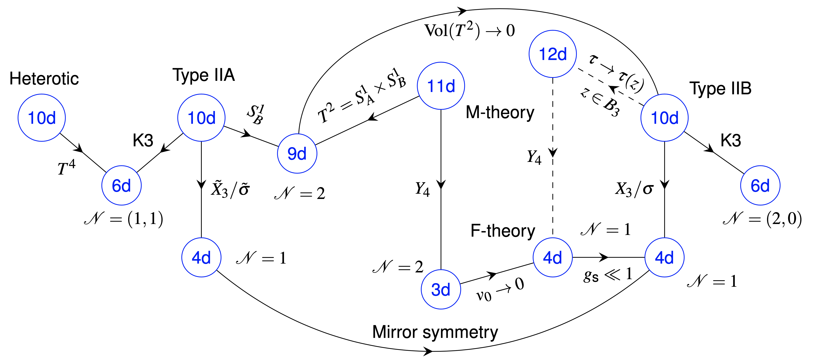

 

Effective field theories (EFTs) have been the subject of recent debates regarding their relative importance for a UV complete theory of gravity. On the one hand, based on the outstanding success of EFTs to describe all kinds of physical phenomena, a common bottom-up attitude is to fully concentrate on EFTs at low-energies assuming that their self-consistency is enough to expect that they can be completed in the UV. On the other hand, the swampland programme argues that most EFTs cannot be UV completed, and concentrates on conjectures that could eliminate general classes of EFTs.

 
 

My interests concern an alternative, more traditional, top-down approach by performing systematic studies of α′ corrections to the 4D effective action of compactified string theories which automatically provide a UV completion. Extracting reliable low-energy information from string compactifications notoriously requires a detailed understanding of the UV sensitivity of the corresponding EFTs. Despite astonishing efforts in computing string scattering amplitudes, systematically deriving corrections to the tree-level actions remains as a key challenge. Overall, progress in these directions may have striking impact on a great variety of areas ranging from AdS/CFT over black hole physics to fundamental cosmology.

Hereby, I'm following several strategies: 

## Multi-dimensional investigations of higher derivative corrections
 
 

 
 

 

Using the powerful machinery of string dualities and symmetries, I have made progress via multi-dimensional investigations of effective actions obtained from string perturbation theory and subsequent compactifications. By examining higher derivative and string loop corrections, my aim is to establish a unifying approach towards constructing and completing such actions, especially at the eight derivative level in the Ramond-Ramond (RR) sector of type IIB string theory. Specifically, I have studied Schwinger type calculations using a string-inspired formalism of the 11D superparticle which are simulatenously compared to conventional string amplitudes. Interestingly, 

## Calabi-Yau compactifications and perturbative corrections

 

